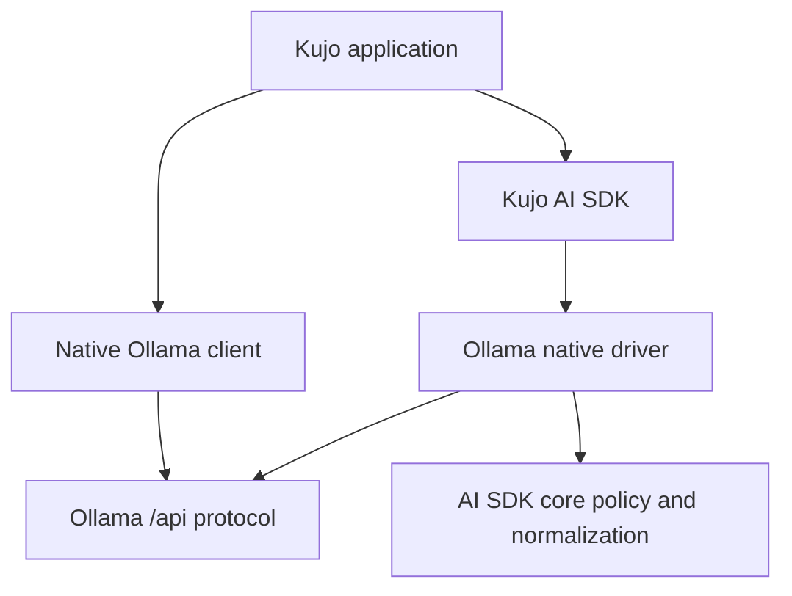

# Ollama Implementation Report

## Executive Summary

The early Ollama package provides a native Ollama client plus a native AI SDK provider driver. The package is intentionally experimental and now depends reproducibly on the released AI SDK `v1.1.0`.

## Current Ollama API evidence

Official Ollama REST documentation and official Python/JavaScript client sources were inspected on 2026-08-26. The implementation records local `http://localhost:11434`, cloud `https://ollama.com`, native chat/generate/embed/model-management/version endpoints, NDJSON streaming, optional cloud Bearer auth, and model-dependent tools, structured output, thinking, and multimodal fields. Native REST responses retain Ollama fields; official client object ergonomics are not emulated as typed Kujo objects.

## Architecture

## Native API coverage

| Operation | Implemented | Tested Offline | Live Smoke | Notes |
|---|---:|---:|---:|---|
| chat/generate/embed/embeddings | yes | yes | skipped | Native response envelope preserves provider data. |
| stream | yes | yes | skipped | Native newline-delimited JSON. |
| list/running/show/version | yes | yes | skipped | Native discovery endpoints. |
| pull/push/create/copy/delete | yes | yes | skipped | Request fixtures; no destructive live tests. |
| tools/format/think/keep_alive | yes | yes | skipped | Capability remains model-dependent. |

## Public exports and Kennel

`from ollama import chat, generate, embed, create_client` and `from provider import ollama_provider` are package-root compatibility imports. The manifest exports `ollama`, `client`, and `provider`; AI SDK public modules are consumed through its established `src.*` import convention. The immutable dependency is `github:kujolang/ai-sdk@v1.1.0`.

## Authentication and security

Local HTTP sends no `Authorization` header. `https://ollama.com` reads `OLLAMA_API_KEY` when no explicit key is supplied and sends Bearer auth. Custom HTTPS hosts do not receive that key automatically. Localhost HTTP is allowed; other remote HTTP, embedded credentials, query/fragment data, and control characters are rejected. Errors redact configured keys. The driver returns descriptors and semantic data; AI SDK core retains transport, retry, header, and final-result authority.

## AI SDK driver

The native driver implements `describe`, `validate`, `encode_chat`, `decode_chat`, `decode_error`, `decode_stream`, `encode_embeddings`, and `decode_embeddings`. Ollama `done_reason` maps to `finish_reason`; `prompt_eval_count`/`eval_count` map to input/output usage; native `message.tool_calls` maps to normalized tool calls. The optional OpenAI-compatible helper targets `/v1` and is secondary.

## Tests and live validation

Source offline gate: native client `6/6`, driver `4/4`, aggregate `10/10`. The installed-package gate performs two installs from the lockfile, validates the manifest, and runs a consumer smoke: `1/1`. Live Ollama validation skipped: environment unavailable.

## Known limitations

Responses are dictionaries rather than typed Python/JavaScript client objects. Streaming is exposed through injected/buffered response chunks. Lifecycle progress has no dedicated progress iterator. Public Kennel registry distribution is not operated yet; the supported path is an immutable GitHub source reference.

## Provider package lessons

Keep native fidelity and AI SDK normalization separate; pin dependencies to immutable refs; expose package-root shims that explicitly export the public surface; configure installed package roots for consumer execution; use deterministic transport fixtures; and keep provider-specific behavior out of AI SDK core.

## Ready for Anthropic Reference Validation?

YES
